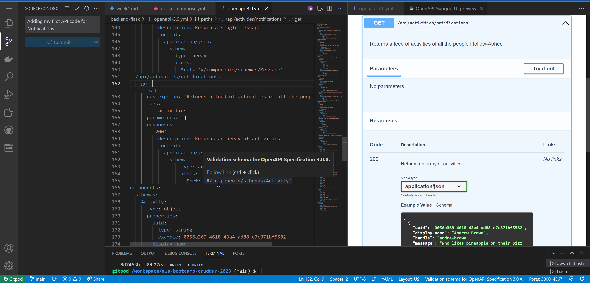
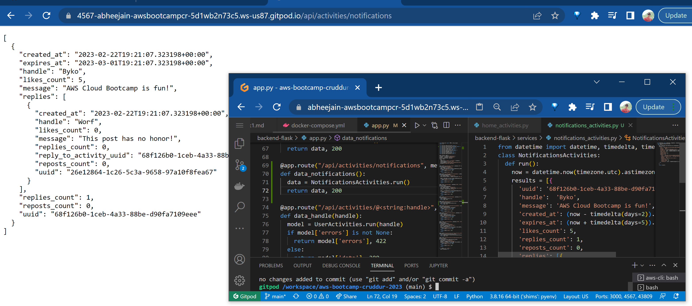
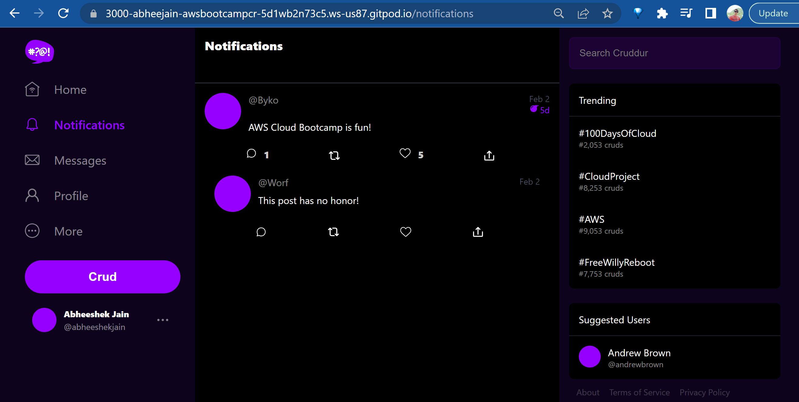

# Week 1 — App Containerization

## Containerize Application (Dockerfiles, Docker Compose)
Created both containers
- Backend 
- Frontend

Worked on running the both contaienrs on Local environment 

Run the both Containers locally using Gitpod. 

Finally got the Containers running together using docker-copose.yml` 

Proof of the Backend Container running 
## Verificaton Image

Proof of the Frontend Container running
## Verificaton Image

## Document the Notification Endpoint for the OpenAI Document

## Verificaton Image

## Write a Flask Backend Endpoint for Notifications 

## Verificaton Image

 

## Write a React Page for Notifications

Finished bare minimum to start for Week 2 :) 

## Verificaton Image

## Run DynamoDB Local Container and ensure it works

## Run Postgres Container and ensure it works

