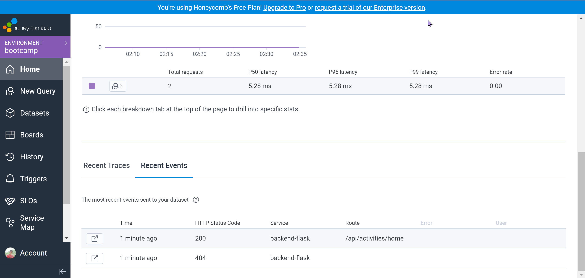
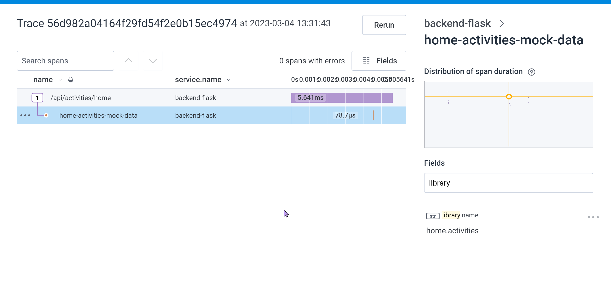
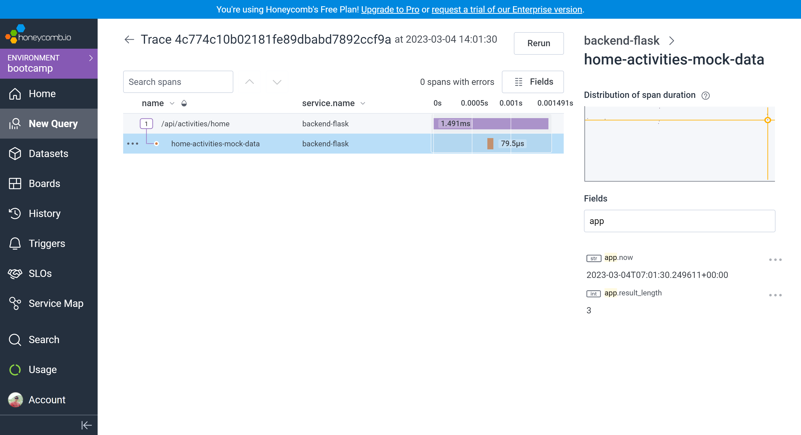
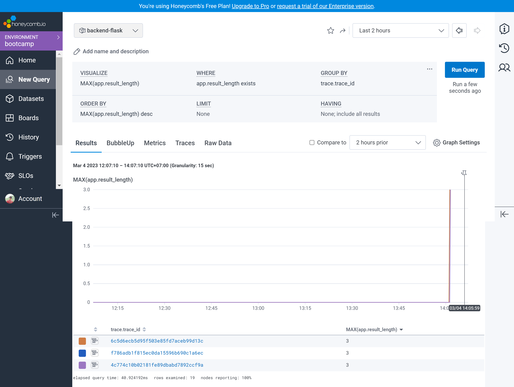
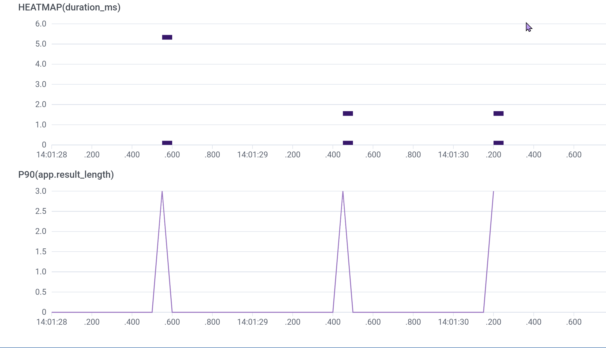

# Week 2 — Distributed Tracing

## Instrument our backend flask application to use Open Telemetry (OTEL) with Honeycomb.io as the provider
- Instrumented - Backend 
 
Connecting to the Honeycomb was just fixed by `exporting` the `key`

Proof of the Instrumentation with Honeycomb 
## Verificaton Image

Adding span for the Mock-data in Honeycomb for the Home Page activites 
## Verificaton Image

## Run queries to explore traces within Honeycomb.io

Running various querries was done using the reference from https://docs.honeycomb.io/getting-data-in/opentelemetry/python/ to `acquiring the Tracer` and for `Query to trace` 

Various Queries run and results received for `app.data` and `app_results_length` 
## Verificaton Image
### ISOFormat Query

### Adding Span for Result Length 

### Query for the P90ms on 

