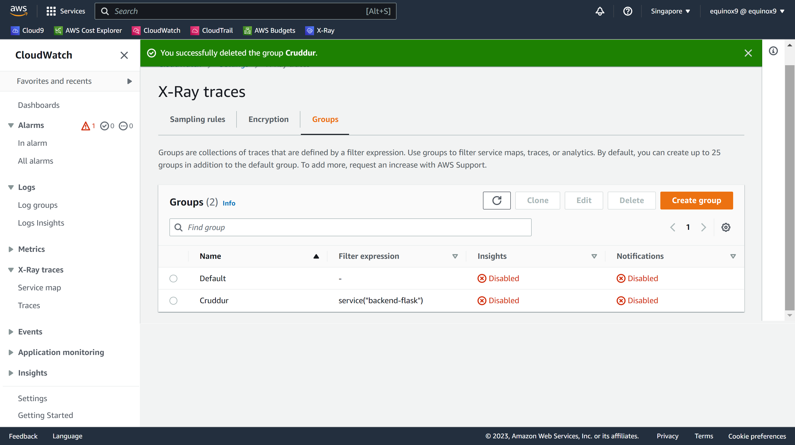
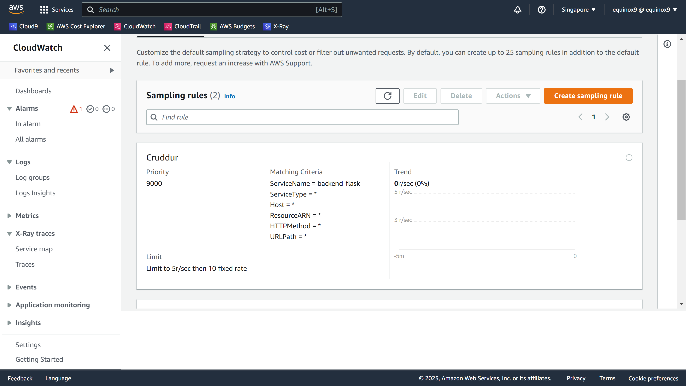
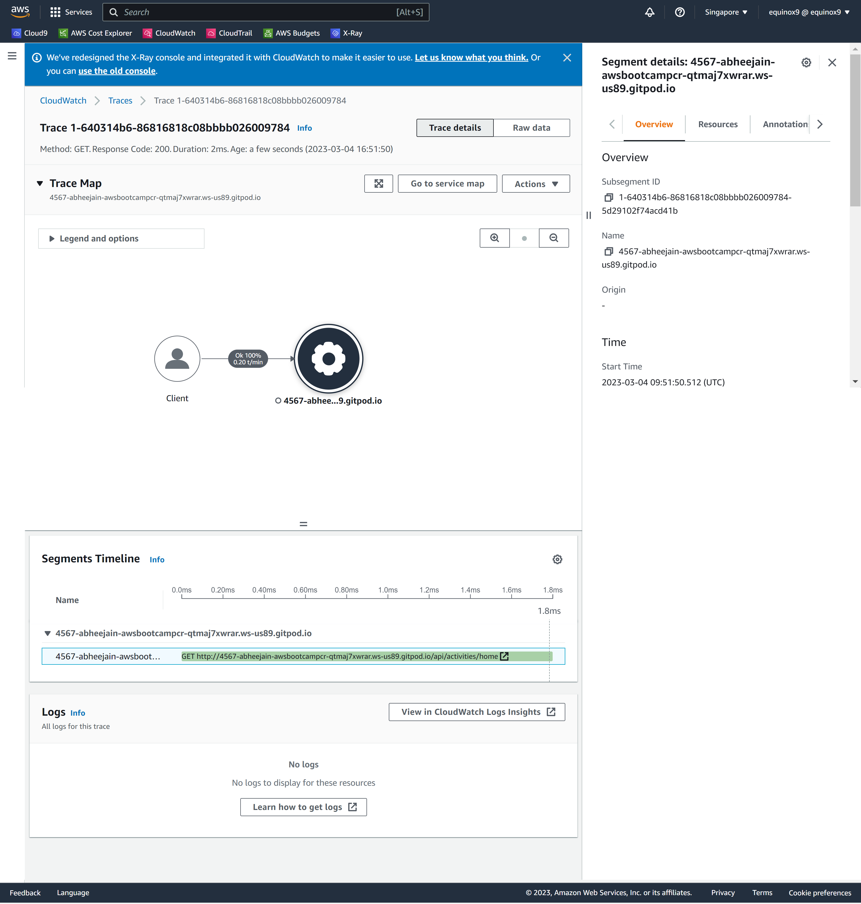
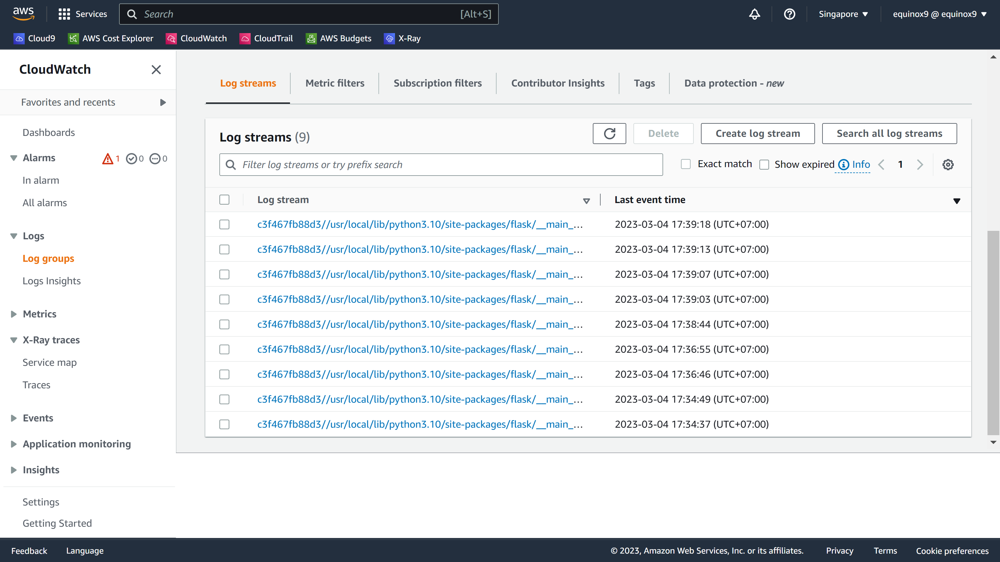
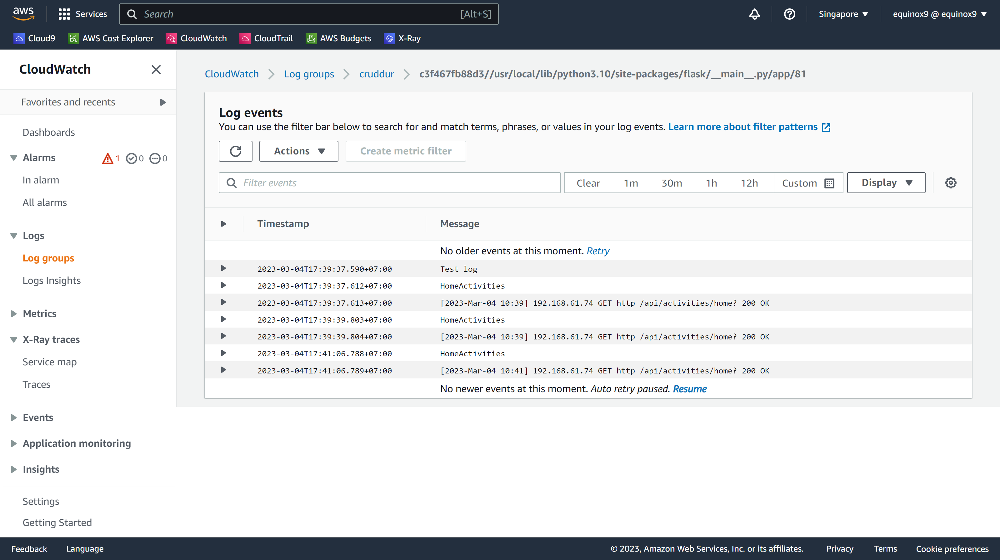
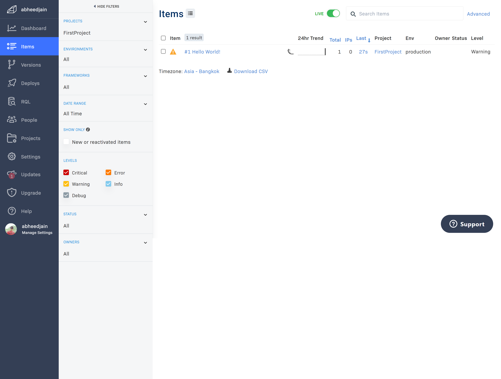
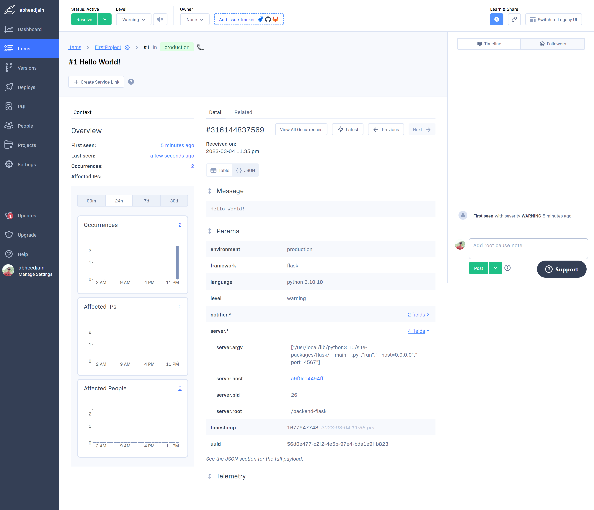
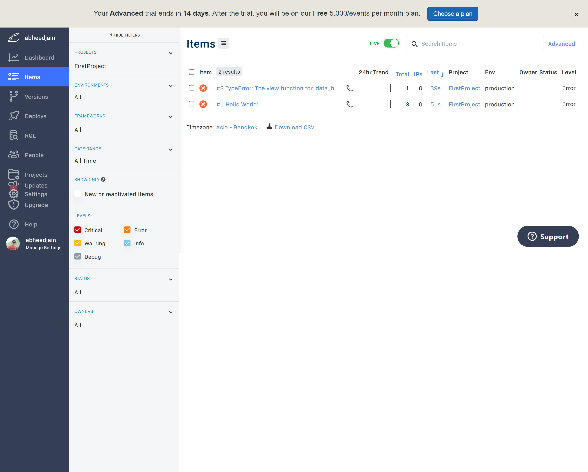
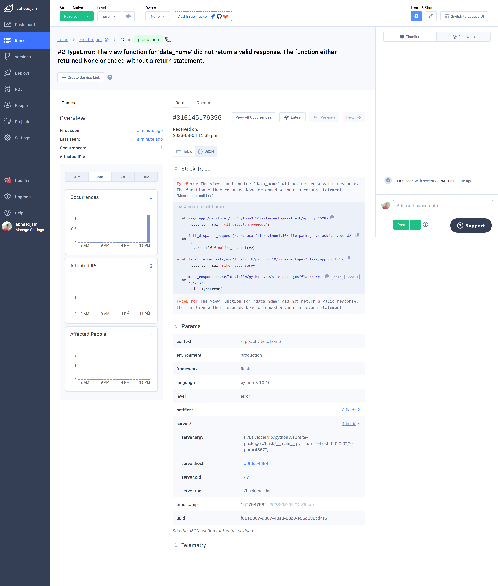

# Week 2 — Distributed Tracing

## Instrument our backend flask application to use Open Telemetry (OTEL) with Honeycomb.io as the provider
- Instrumented - Backend 
 
Connecting to the Honeycomb was just fixed by `exporting` the `key`

Proof of the Instrumentation with Honeycomb 
## Verificaton Image

Adding span for the Mock-data in Honeycomb for the Home Page activites 
## Verificaton Image

## Run queries to explore traces within Honeycomb.io

Running various querries was done using the reference from https://docs.honeycomb.io/getting-data-in/opentelemetry/python/ to `acquiring the Tracer` and for `Query to trace` 

Various Queries run and results received for `app.data` and `app_results_length` 
## Verificaton Image
### ISOFormat Query

### Adding Span for Result Length 

### Query for the P90ms on 

## Instrument AWS X-Ray into backend flask application

- Setup X-Ray Traces 
After receiving JSON log 
https://ap-southeast-1.console.aws.amazon.com/cloudwatch/home?region=ap-southeast-1#xray:settings/groups

## Verificaton Image

- Added Sampling Rules using `AWS CLI`
    We used CLI, compared to the AWS Console because, the interface keep changing, but we know the values to set using CLI is easy.

## Verificaton Image

## X-Ray Instrumented

## Verificaton Image

## Add X-Ray sub-segment

Ref: https://github.com/aws/aws-xray-sdk-python
Tried to workput with the `UserActivities` service, but received `500` error`. I would skip now and keep it for my extended homework 

## Cloudwatch Instrumented
## Verificaton Image

### Home Activities Cloudwatch Logs

## Verificaton Image

## Integrate Rollbar for Error Logging

## Verificaton Image

New UI More events
## Verificaton Image

## Trigger an error an observe an error with Rollbar
## Verificaton Image

 
Error Details
## Verificaton Image

