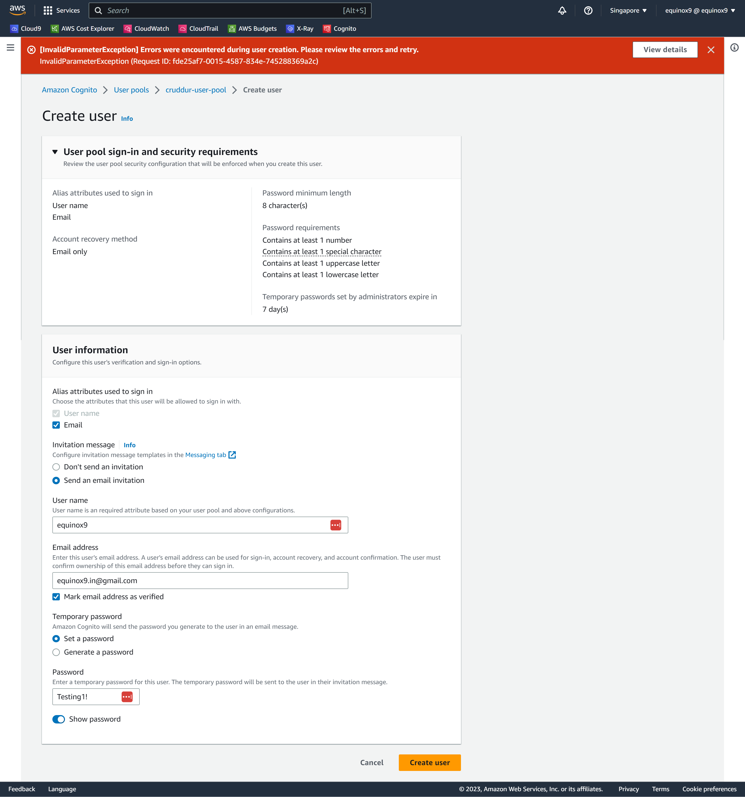

# Week 3 — Decentralized Authentication

## Provision via ClickOps a Amazon Cognito User Pool
- This task was done manually to create a Cognito Pool in various steps. 

Proof of the AWS Cognito Pool Creation 
## Verificaton Image

Proof of the AWS Cognito Pool Details 
## Verificaton Image

- Next was to Install and configure Amplify client-side library for Amazon Congito, tested with an error message

## Verificaton Image

### Implement API calls to Amazon Coginto for custom login, signup, recovery and forgot password page

## Implement Custom Signin Page
- Started with Sign in Page

## Verificaton Image

- New User added to the User Pool
## Verificaton Image

- Email Received at the User Email 
## Verificaton Image

## Implement Custom Signup Page

## Implement Custom Confirmation Page

## Implement Custom Recovery Page

## Watch about different approaches to verifying JWTs

