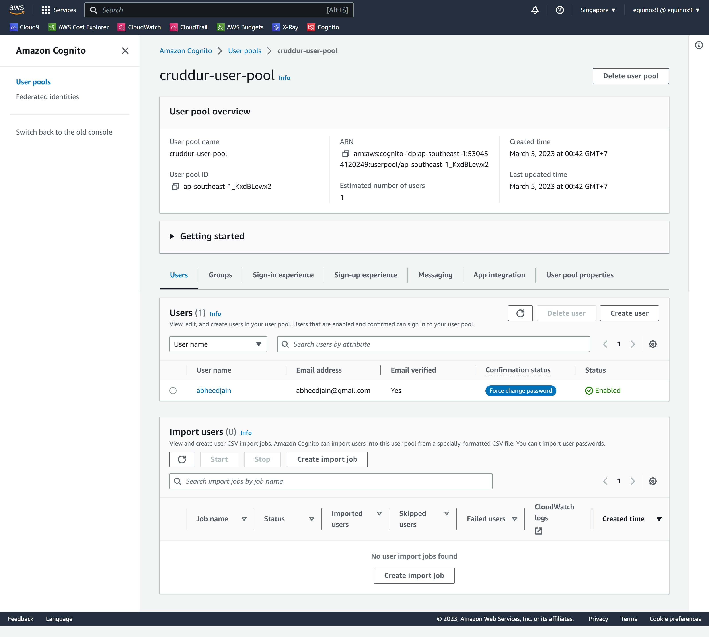
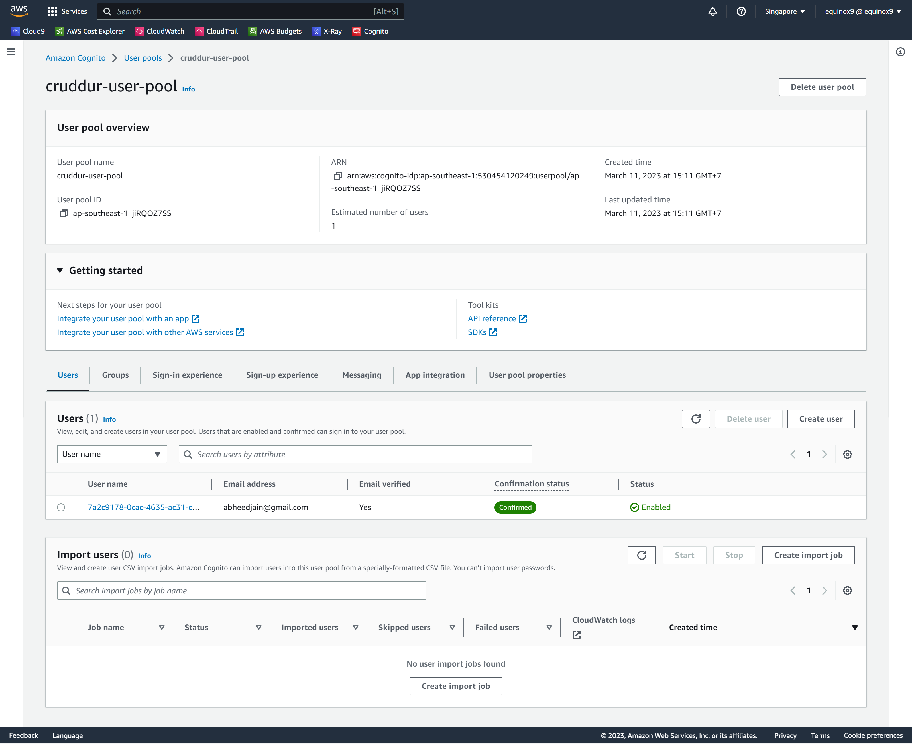

# Week 3 — Decentralized Authentication

## Provision via ClickOps a Amazon Cognito User Pool
- This task was done manually to create a Cognito Pool in various steps. 

Proof of the AWS Cognito Pool Creation 
## Verificaton Image


Proof of the AWS Cognito Pool Details 
## Verificaton Image



<hr>

- Next was to Install and configure Amplify client-side library for Amazon Congito, tested with an error message

## Verificaton Image


<hr>

### Implement API calls to Amazon Coginto for custom login, signup, recovery and forgot password page

## Implement Custom Signin Page
- Started with Sign in Page

## Verificaton Image


<hr>

- New User added to the User Pool
## Verificaton Image


- Email Received at the User Email 
## Verificaton Image


- User Confirmed using CLI

The user status was showing `Confirmation status` as `Force change password` which is not ble to login until it changes to `Confirmed` 
Ref: https://stackoverflow.com/questions/40287012/how-to-change-user-status-force-change-password 


## Verificaton Image


- User was able to login after Status shown as `Confirmed`

## Verificaton Image


- User Handle is still not updated, because we have not mentioned or selected to set the `attributes` while creating the User Pool, so I changed it manually in the `Edit User` on the Cognito Pool Console  

## Verificaton Image Before


- Added the `Prefered Username` attribute to the user

## Verificaton Image Before


## Verificaton Image After


<hr>

NOTE: The verification is done for the `Signin Page`, and it is not good practice to add users manually, we will delete the Users from Cognito Pool and go ahead to proceed setting up for `Signup Page`

## Verificaton Image


<hr>

## Implement Custom Signup Page

- Updated Signup page with Amplify

## Verificaton Image


- Received Verifictoin email in the email

## Verificaton Image


- Confirmed and went to next page after verification Code

## Verificaton Image


- Cognito Pool Showing the User added to the pool

## Verificaton Image


<hr>

## Implement Custom Confirmation Page

- Using `Forgot Password`

## Verificaton Image


- Received another code for Recover Account

## Verificaton Image


<hr>

## Implement Custom Recovery Page

- Recover Account setup using Amplify

## Verificaton Image


- Confirmed on the Recover Password worked with Username and Preferred Username 

## Verificaton Image


<hr>

## Watch about different approaches to verifying JWTs

- how-to-get-http-headers-in-flask (Code COmmitted)
Ref: https://stackoverflow.com/questions/29386995/how-to-get-http-headers-in-flask

- Next To add FLASJ-AWSCOgnito TOKEN
Ref: https://github.com/cgauge/Flask-AWSCognito 
Ref: https://github.com/cgauge/Flask-AWSCognito/blob/master/flask_awscognito/services/token_service.py

Note: A common URL to get the `jwks.json`
https://cognito-idp.{self.region}.amazonaws.com/{self.user_pool_id}/.well-known/jwks.json

So According to https://github.com/cgauge/Flask-AWSCognito
We crated ENV Variables in `Docker-Compose`in `backend` block

```
app.config['AWS_COGNITO_USER_POOL_ID'] = 'eu-west-1_XXX'
app.config['AWS_COGNITO_USER_POOL_CLIENT_ID'] = 'YYY'
```
## Finally got the `User Authenticated` 

```
[2023-03-13 16:57:42,084] DEBUG in app: authenicated
[2023-03-13 16:57:42,084] DEBUG in app: {'sub': '7a2c9178-0cac-4635-ac31-c44a4c14c043', 'iss': 'https://cognito-idp.ap-southeast-1.amazonaws.com/ap-southeast-1_jiRQOZ7SS', 'client_id': '7p3n1sa7ea43n6q205g82fnu9', 'origin_jti': 'd1b2362d-3763-4215-8a74-200b2d32d932', 'event_id': '54065754-53b0-40fa-9e44-3d3e4acb55a8', 'token_use': 'access', 'scope': 'aws.cognito.signin.user.admin', 'auth_time': 1678726660, 'exp': 1678730260, 'iat': 1678726660, 'jti': 'f7ca19d1-718e-4a66-b4ad-1b46670c0786', 'username': '7a2c9178-0cac-4635-ac31-c44a4c14c043'}
[2023-03-13 16:57:42,084] DEBUG in app: 7a2c9178-0cac-4635-ac31-c44a4c14c043
192.168.195.11 - - [13/Mar/2023 16:57:42] "GET /api/activities/home HTTP/1.1" 200 -
```
## Verificaton Image


<hr>
