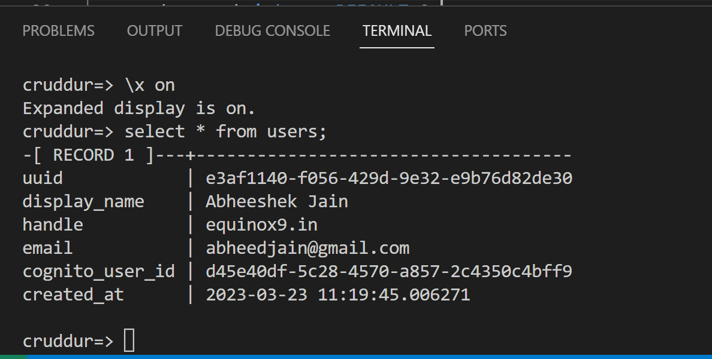

# Week 4 — Postgres and RDS

## Create RDS Postgres Instance 

Proof of the RDS Postgres Instance Creation 

## Verificaton Image

## Bash scripting for common database actions
- Created various `bash scripts` to make it wasy to interact with the local and the Prod daabases
## Verificaton Image

## Install Postgres Driver in Backend Application
## Verificaton Image

## Connect Gitpod to RDS Instance
## Verificaton Image

## Create Congito Trigger to insert user into database
## Verificaton Image

### Notes: 
`Configuration` -  `Permissions`
The provided execution role does not have permissions to call CreateNetworkInterface on EC2

So need to Add Policy in addition to the existing `Configuration` - `Permissions` - Role - `roles/cruddur-post-confirmation-role-a2i0hdsu`

Created new Policy and attached 
Ref: https://stackoverflow.com/questions/41177965/aws-lambdathe-provided-execution-role-does-not-have-permissions-to-call-describ

Managed Policy Created: `AWS-Lambda-VPC-Access-Execution-Role`

## Create new activities with a database insert
## Verificaton Image

